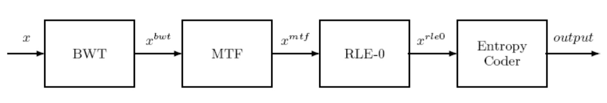

# Text compression

C++ command-line tool for text compression and decompression using the Burrows-Wheeler transform and static Huffman coding.

## Description:

There are 4 main steps in the encoding/decoding process: 



1. Burrows-Wheeler transform (BWT)
2. Move-To-Front coding (MTF) 
3. Run-Length-Encoding (RLE-0) 
4. Static Huffman coding (Entropy coder)

Each step is implemented as a separate class which can encode or decode a block of data. 
These are then used in the main class of the program in the given order for encoding and in the opposite order for decoding.

## Usage:

`app_name [-i <ifile>] [-o <ofile>] [-l <logFile>] {-c | -x | -h}`

`-i <ifile>` the name of the input file. If not specified, input is read from `stdin`\
`-o <ofile>` the name of the output file. If not specified, output is written to `stdout`\
`-l <logfile>` the name of the output log file. If not specified, no log is created\
`-c` encode the input\
`-x` decode the input\
`-h` print help information to `stdout` and exit

The output log file will contain the sizes of both the compressed and uncompressed data (in bytes) in this format:

```
uncodedSize = size
codedSize = size
```

